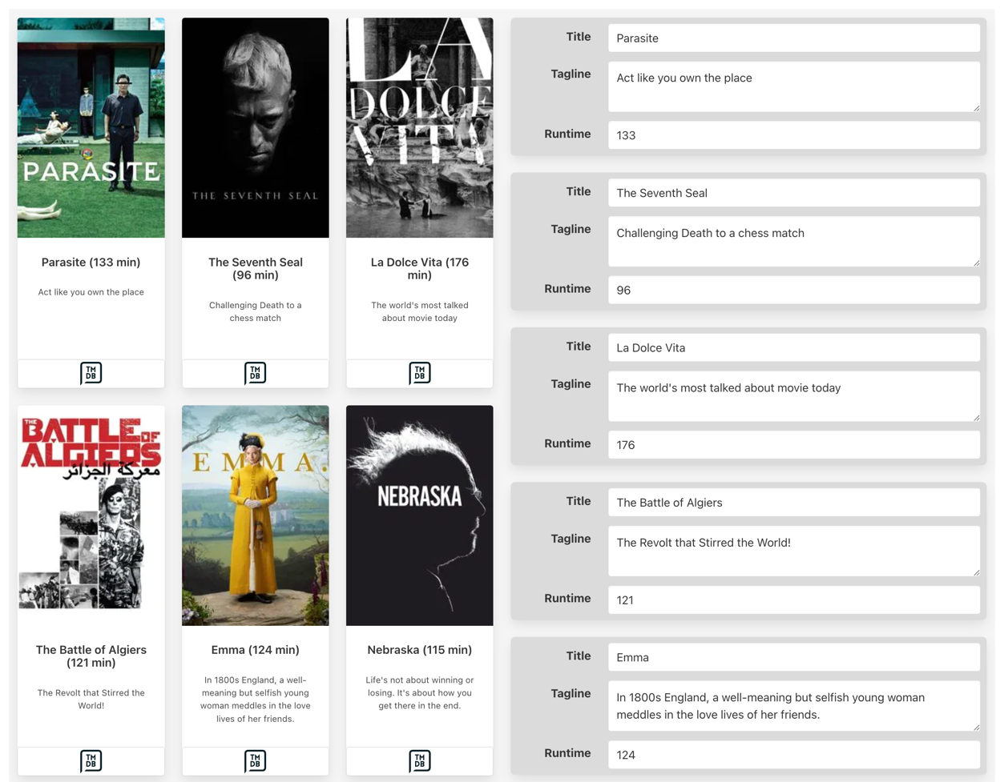

# React003
This is an in class activity for CSC 350, which covers rendering React components.
## Github Classrooms
1. From now on, we will be using Github classroom to do in-class activities. 
## Commit Message Guidelines
When working on your branch, feel free to make as many commits and pushes as necessary.

To keep things consistent, use the following commit message style, as established in Project I:

### Format

```
[PREFIX] - [Short description of the change]
```

### Allowed Prefixes

- **FEAT** – For new features or major additions to the project.  
  _Example:_  
  `FEAT - Added contact form to the Contact page`

- **FIX** – For bug fixes, corrections, or revisions to the code.  
  _Example:_  
  `FIX - Corrected navigation bar alignment on mobile devices`

- **STYLE** – For stylistic changes such as formatting, CSS modifications, or minor visual updates.  
  _Example:_  
  `STYLE - Updated color scheme for better contrast`

- **DOCS** – For changes or additions to documentation, including README files and code comments.  
  _Example:_  
  `DOCS - Added project description and setup instructions to README`

- **SECURITY** – For improvements related to website or application security.  
  _Example:_  
  `SECURITY - Implemented input validation for contact form`

- **REFACTOR** – For code refactoring that does not affect functionality but improves code quality or structure.  
  _Example:_  
  `REFACTOR - Organized CSS files and cleaned up redundant styles`

- **TEST** – For adding or updating tests.  
  _Example:_  
  `TEST - Added validation tests for contact form input`

2. Submitting your work
   Once, you are sure that all the work is completed, go through the following steps for submission.

Go to your repository copy on GitHub.
Click on the “Pull requests” tab and then the “New pull request” button.
Select the branch you pushed your changes to.
Click “Create pull request” and provide a title and description for your changes.
Submit the pull request.
If you have made a pull request on error or have made further changes to the branch, you can always close the pull request that was made and make a new pull request.
The closest pull request to the due date will be reviewed.
3. Grading and Feedback
   After the submission deadline, your pull request will be reviewed.
   Feedback and grades will be provided based on the changes made and the quality of the work.
   Not sure, how to create a pull request, check this link.

# Project description
This project requires the creation of multiple interconnected components. The following figure illustrates what the finished version should look like along with the required
component hierarchy. Changing any of the form fields on the right will update the
movie display on the left.



1. The starting of the components and their `render()` methods have been
provided. The data is contained within the file movie-data.js. You can
complete this project using the techniques covered React lesson.
You could instead use create-react-app as your starting point.
2. Implement the rest of the `MovieList`, `SingleMovie`, and `MovieLink` components. For `MovieList`, you will need to render a `<SingleMovie>` for each
   movie in the passed list of movies using map(). You will need to pass a movie
   object to `SingleMovie`. For `SingleMovie`, you will need to replace the sample
   data with data from the passed-in movie object. In the footer area, you will
   render a `<MovieLink>` and pass it the `tmdbID` property from the movie object. 
`MovieLink` must be a functional component. It will return markup similar to
   the following (though you will replace 1366 with the passed `tmdbID` value):

   `<a className="button card-footer-item"`

   `href="https://www.themoviedb.org/movie/1366" >`

   ``

   `</a>`
3. In the `App` component, you will add the `<MovieList>` component to the render.
   Be sure to pass it the list of movies in state. Test.
4. In the `App` component, use `map()` to output a `<MovieForm>` for each movie. Be
   sure to pass both index and key values to each `MovieForm`. Also pass the
   `saveChanges` method to each `MovieForm`. Test.
5. Make `MovieForm` a Controlled Form Component. This will require creating
   some type of handler method within `MovieForm` that will call the `saveChanges`
   method that has been passed in (see also next step).
6. Implement `saveChanges` in the App component. Notice that it expects a movie
   object that contains within it the new data. Your method will use the index to
   replace the movie object from the movies data with the new data, and then
   update the state. Test.


**Break this problem down into smaller steps. Verify each component works as you create them.** 
